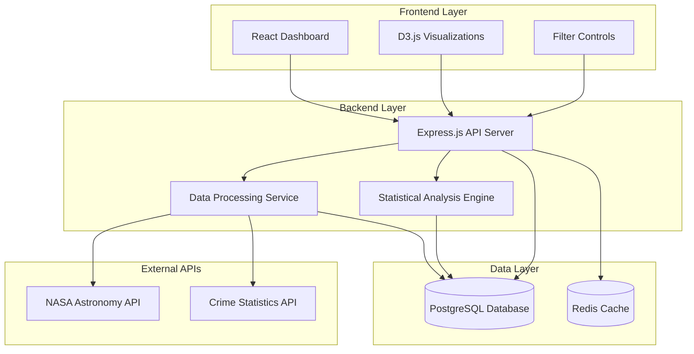

# Lunar Crime Analyzer - Design Document

## Overview

The Lunar Crime Analyzer is a web-based dashboard that investigates potential correlations between lunar cycles and criminal activity patterns. The system integrates astronomical data with crime statistics to provide researchers and analysts with interactive visualizations and statistical insights into temporal relationships between moon phases and various types of criminal incidents.

The application follows a modern web architecture with a React frontend, Node.js backend, and PostgreSQL database optimized for time-series data. The system emphasizes data accuracy, statistical rigor, and user-friendly visualizations to support evidence-based research into lunar-crime correlations.

## Architecture

### System Architecture



### Technology Stack

**Frontend:**
- React 18 with TypeScript for type safety
- D3.js for custom interactive visualizations
- Material-UI for consistent component design
- React Query for efficient data fetching and caching

**Backend:**
- Node.js with Express.js framework
- TypeScript for type safety across the stack
- Axios for external API integration
- Node-cron for scheduled data updates

**Database:**
- PostgreSQL with TimescaleDB extension for time-series optimization
- Redis for caching frequently accessed data and API responses

**Statistical Analysis:**
- Simple-statistics library for correlation calculations
- Custom algorithms for lunar cycle analysis

## Components and Interfaces

### Frontend Components

#### Dashboard Interface
- **LocationSelector**: Geographic area selection with autocomplete
- **DateRangePicker**: Time period selection with preset options
- **FilterPanel**: Crime type, severity, and time-of-day filters
- **CorrelationChart**: Main visualization showing lunar-crime relationships
- **StatisticsPanel**: Display of correlation coefficients and significance tests
- **ExportControls**: Report generation and sharing functionality

#### Visualization Components
- **LunarCycleChart**: Timeline showing moon phases over selected period
- **CrimeIncidentChart**: Scatter plot of crime incidents mapped to lunar data
- **CorrelationHeatmap**: Grid showing correlation strength across different crime types
- **TrendAnalysisChart**: Line chart showing crime frequency trends relative to moon phases

### Backend Services

#### API Endpoints
```typescript
interface APIEndpoints {
  // Location and data availability
  GET /api/locations: LocationInfo[]
  GET /api/locations/:id/availability: DataAvailability
  
  // Data fetching
  GET /api/moon-phases: MoonPhaseData[]
  GET /api/crime-data: CrimeIncident[]
  
  // Analysis
  POST /api/correlations: CorrelationAnalysis
  GET /api/statistics: StatisticalSummary
  
  // Export and sharing
  POST /api/export: ExportResult
  GET /api/shared/:id: SharedAnalysis
}
```

#### Data Processing Service
- **AstronomicalDataFetcher**: Retrieves and validates moon phase data
- **CrimeDataFetcher**: Fetches and normalizes crime statistics
- **TimestampAligner**: Synchronizes temporal data across sources
- **DataValidator**: Ensures data quality and completeness

#### Statistical Analysis Engine
- **CorrelationCalculator**: Computes Pearson correlation coefficients
- **SignificanceTest**: Performs chi-square and t-tests for statistical significance
- **TrendAnalyzer**: Identifies patterns and anomalies in lunar-crime relationships
- **ReportGenerator**: Creates statistical summaries and confidence intervals

## Data Models

### Core Data Structures

```typescript
interface MoonPhaseData {
  timestamp: Date;
  phaseName: 'new' | 'waxing_crescent' | 'first_quarter' | 'waxing_gibbous' | 
            'full' | 'waning_gibbous' | 'last_quarter' | 'waning_crescent';
  illuminationPercent: number; // 0-100
  phaseAngle: number; // 0-360 degrees
  distanceKm: number;
  location: GeographicCoordinate;
}

interface CrimeIncident {
  id: string;
  timestamp: Date;
  location: GeographicCoordinate;
  crimeType: CrimeType;
  severity: 'misdemeanor' | 'felony' | 'violation';
  description: string;
  caseNumber?: string;
  resolved: boolean;
}

interface CrimeType {
  category: 'violent' | 'property' | 'drug' | 'public_order' | 'white_collar';
  subcategory: string;
  ucr_code?: string; // FBI Uniform Crime Reporting code
}

interface GeographicCoordinate {
  latitude: number;
  longitude: number;
  address?: string;
  jurisdiction: string;
}

interface CorrelationResult {
  crimeType: CrimeType;
  moonPhase: string;
  correlationCoefficient: number;
  pValue: number;
  confidenceInterval: [number, number];
  sampleSize: number;
  significanceLevel: number;
}
```

### Database Schema

```sql
-- Time-series optimized tables using TimescaleDB
CREATE TABLE moon_phases (
  timestamp TIMESTAMPTZ NOT NULL,
  phase_name VARCHAR(20) NOT NULL,
  illumination_percent DECIMAL(5,2) NOT NULL,
  phase_angle DECIMAL(6,2) NOT NULL,
  distance_km INTEGER NOT NULL,
  latitude DECIMAL(10,8) NOT NULL,
  longitude DECIMAL(11,8) NOT NULL
);

CREATE TABLE crime_incidents (
  id UUID PRIMARY KEY,
  timestamp TIMESTAMPTZ NOT NULL,
  latitude DECIMAL(10,8) NOT NULL,
  longitude DECIMAL(11,8) NOT NULL,
  crime_category VARCHAR(50) NOT NULL,
  crime_subcategory VARCHAR(100) NOT NULL,
  severity VARCHAR(20) NOT NULL,
  description TEXT,
  case_number VARCHAR(50),
  jurisdiction VARCHAR(100) NOT NULL,
  resolved BOOLEAN DEFAULT FALSE
);

-- Create hypertables for time-series optimization
SELECT create_hypertable('moon_phases', 'timestamp');
SELECT create_hypertable('crime_incidents', 'timestamp');

-- Indexes for efficient querying
CREATE INDEX idx_moon_phases_location ON moon_phases (latitude, longitude, timestamp);
CREATE INDEX idx_crime_incidents_location ON crime_incidents (latitude, longitude, timestamp);
CREATE INDEX idx_crime_incidents_type ON crime_incidents (crime_category, timestamp);
```

## Correctness Properties

*A property is a characteristic or behavior that should hold true across all valid executions of a system-essentially, a formal statement about what the system should do. Properties serve as the bridge between human-readable specifications and machine-verifiable correctness guarantees.*

### Property Reflection

After analyzing all acceptance criteria, several properties can be consolidated to eliminate redundancy:

- Location validation, API data validation, and filter validation all follow similar patterns and can be grouped
- Chart interactivity properties (hover, zoom, pan) can be combined into comprehensive UI interaction properties
- Export functionality properties can be consolidated into comprehensive export validation
- Timestamp and data alignment properties can be combined into temporal data integrity properties

### Core Properties

**Property 1: Location validation consistency**
*For any* geographic input, the location validation should correctly identify data availability and provide appropriate feedback (valid locations enable date selection, invalid locations suggest alternatives)
**Validates: Requirements 1.2, 1.3, 1.4**

**Property 2: API integration reliability**
*For any* valid location and date combination, the system should successfully fetch both astronomical and crime data, with proper retry logic handling any temporary failures
**Validates: Requirements 2.2, 2.3**

**Property 3: Data validation completeness**
*For any* received dataset (astronomical or crime), the validation process should correctly identify and handle malformed records while preserving valid data
**Validates: Requirements 2.4, 2.5, 6.4**

**Property 4: Chart generation consistency**
*For any* valid combination of moon phase and crime data, the system should generate interactive correlation charts with all required features (zoom, pan, hover tooltips)
**Validates: Requirements 3.1, 3.2, 3.3**

**Property 5: Filter application accuracy**
*For any* applied filter combination (crime type, time-of-day, severity), all visualizations should update to show only data matching the selected criteria
**Validates: Requirements 4.2, 4.3, 4.4**

**Property 6: Filter reset completeness**
*For any* previously applied filter state, clearing filters should restore the complete dataset for the selected location and time period
**Validates: Requirements 4.5**

**Property 7: Export generation completeness**
*For any* analysis configuration, exported reports should include all required elements (charts, statistics, correlation coefficients) in the requested format
**Validates: Requirements 5.2, 5.4, 5.5**

**Property 8: Configuration sharing round-trip**
*For any* saved analysis configuration, accessing the shared link should restore the exact location, time period, filters, and visualization settings
**Validates: Requirements 5.3**

**Property 9: Temporal alignment accuracy**
*For any* combination of astronomical and crime datasets, the temporal alignment should precisely match crime incidents with corresponding moon phase data based on synchronized timestamps
**Validates: Requirements 6.1, 6.2, 6.3**

**Property 10: Data integrity validation**
*For any* completed temporal alignment, all crime incidents should fall within the available moon phase date ranges, ensuring complete temporal coverage
**Validates: Requirements 6.5**

## Error Handling

### API Error Management
- **Retry Strategy**: Exponential backoff with jitter (1s, 2s, 4s, 8s, 16s max)
- **Timeout Handling**: 30-second timeout for API requests with graceful degradation
- **Rate Limiting**: Respect API rate limits with intelligent queuing
- **Fallback Data**: Cache recent data for offline analysis when APIs are unavailable

### Data Quality Assurance
- **Validation Pipeline**: Multi-stage validation for timestamps, coordinates, and data types
- **Outlier Detection**: Statistical methods to identify and flag anomalous data points
- **Completeness Checks**: Ensure minimum data thresholds for meaningful correlation analysis
- **Error Logging**: Comprehensive logging with structured error codes for debugging

### User Experience Error Handling
- **Progressive Loading**: Show partial results while additional data loads
- **Error Messages**: Clear, actionable error messages with suggested solutions
- **Graceful Degradation**: Maintain core functionality even when some features fail
- **Recovery Options**: Allow users to retry failed operations or use alternative data sources

## Testing Strategy

### Dual Testing Approach

The Lunar Crime Analyzer will implement both unit testing and property-based testing to ensure comprehensive coverage and correctness validation.

**Unit Testing Requirements:**
- Unit tests will verify specific examples, edge cases, and integration points
- Focus on concrete scenarios like specific date ranges, known locations, and error conditions
- Test individual components in isolation with mocked dependencies
- Validate API response parsing with known data formats
- Verify statistical calculations with predetermined datasets

**Property-Based Testing Requirements:**
- Property-based tests will verify universal properties across all valid inputs using **fast-check** library for JavaScript/TypeScript
- Each property-based test will run a minimum of 100 iterations to ensure statistical confidence
- Tests will use intelligent generators that create realistic astronomical and crime data
- Each property-based test will include a comment explicitly referencing the correctness property from this design document
- Property-based test comments will use this exact format: '**Feature: lunar-crime-analyzer, Property {number}: {property_text}**'

**Testing Implementation Guidelines:**
- Each correctness property will be implemented by a single property-based test
- Property-based tests will be placed close to implementation to catch errors early
- Unit tests and property tests are complementary - unit tests catch concrete bugs, property tests verify general correctness
- Both testing approaches together provide comprehensive coverage of the system's behavior

### Test Data Generation

**Astronomical Data Generators:**
- Generate realistic moon phase sequences with proper lunar cycle timing
- Create valid timestamp ranges with appropriate timezone handling
- Generate coordinate data for various geographic locations

**Crime Data Generators:**
- Create realistic crime incident distributions across time and location
- Generate various crime types and severity levels
- Ensure temporal distribution matches real-world patterns

**Integration Test Scenarios:**
- Test complete user workflows from location selection to report export
- Validate data pipeline from API ingestion to visualization rendering
- Verify statistical accuracy with known correlation datasets

## Performance Considerations

### Data Processing Optimization
- **Streaming Processing**: Handle large datasets without memory overflow
- **Indexing Strategy**: Optimize database queries for temporal and geographic lookups
- **Caching Layer**: Redis caching for frequently accessed moon phase calculations
- **Lazy Loading**: Load visualization data progressively as users interact

### Frontend Performance
- **Virtual Scrolling**: Handle large datasets in UI components efficiently
- **Chart Optimization**: Use canvas rendering for large point datasets
- **Debounced Interactions**: Prevent excessive API calls during filter adjustments
- **Progressive Enhancement**: Core functionality works without JavaScript

### Scalability Architecture
- **Horizontal Scaling**: Stateless API design for load balancer distribution
- **Database Partitioning**: Time-based partitioning for efficient historical data queries
- **CDN Integration**: Static asset delivery and API response caching
- **Monitoring**: Performance metrics and alerting for system health

## Security Considerations

### Data Protection
- **API Key Management**: Secure storage and rotation of external API credentials
- **Input Validation**: Sanitize all user inputs to prevent injection attacks
- **Rate Limiting**: Protect against abuse and ensure fair resource usage
- **HTTPS Enforcement**: All communications encrypted in transit

### Privacy Compliance
- **Data Anonymization**: Ensure crime data doesn't expose personal information
- **Geographic Precision**: Limit coordinate precision to protect individual privacy
- **Data Retention**: Implement policies for historical data cleanup
- **User Consent**: Clear disclosure of data sources and usage

### Access Control
- **Authentication**: Optional user accounts for saving and sharing analyses
- **Authorization**: Role-based access for administrative functions
- **Audit Logging**: Track user actions for security monitoring
- **Session Management**: Secure session handling and timeout policies